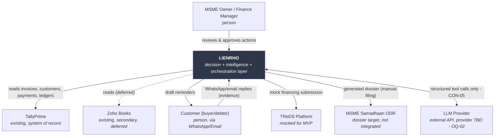
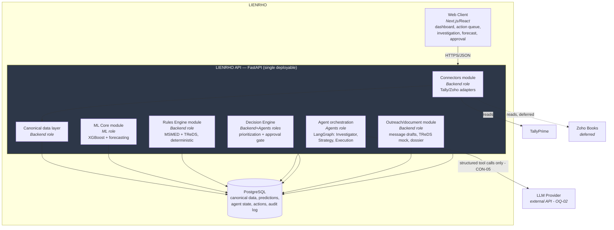

# Inception — LIENRHO

**Tier:** Lite &nbsp;|&nbsp; **Status:** Living — implementation in progress &nbsp;|&nbsp; **Created:** 2026-08-14 &nbsp;|&nbsp; **Updated:** 2026-08-15

> Implementation status per requirement: [`implementation-status.md`](implementation-status.md). Model metrics and limitations: [`model-card.md`](model-card.md). Demo sequencing: [`demo-checkpoints.md`](demo-checkpoints.md).

## 1. Problem

**Who is affected:** MSME (Micro, Small & Medium Enterprise) owners and finance managers in India who manage receivables, cash flow, and payment follow-up largely by hand.

**What they're trying to do:** Decide, every day, which unpaid invoices to chase, finance, or escalate — so that cash actually lands in time to cover payroll, suppliers, rent, and other fixed obligations.

**What blocks them today:** Existing accounting/ERP software (Tally, Zoho Books) is a system of record — it shows *that* ₹42.6L is outstanding across 30 invoices, but not *which* invoices will actually be paid, *when*, or *what to do about it*. The owner is the manual bridge between the accounting system, bank information, customer communications (WhatsApp/email), financing options (TReDS), and statutory/legal rules (MSMED Act) — cross-referencing all of it by hand (PRD §54.1, §4, §104).

**Cost of the status quo:** Cash shortages surface late or go unnoticed until they're imminent (e.g. a ₹6.2L deficit 14 days out); every invoice gets roughly equal manual attention regardless of risk or value; follow-up, financing, and escalation decisions are inconsistent and undocumented. `[ASSUMED]` — the PRD's ₹/day figures are an illustrative demo scenario (§63), not a validated baseline across real MSMEs; treat DSO reduction (below) as the one PRD-sourced, falsifiable target.

**What "solved" looks like:** Each morning the owner sees a prioritized action queue (follow up / finance / escalate) generated automatically from receivables data, payment-risk prediction, cash forecast, statutory/financing eligibility, and communication evidence — without duplicating or replacing their accounting system (PRD §118–120, §548–590).

### Goals

| Level | Goal | Metric / Baseline / Target |
|---|---|---|
| Business | Shrink the gap between "invoiced" and "cash in hand" | DSO reduction of 14–21 days (PRD §90 — the one explicit, sourced target in the PRD) |
| User | Owner can decide today's receivables actions without manually cross-referencing spreadsheets, Tally, and WhatsApp | `[ASSUMED]` time-to-decision drops from manual triage to a single reviewed action queue — no PRD baseline given; flagged as OQ-04 |
| System | Ingest accounting data, score payment risk, forecast liquidity, apply statutory/financing rules, investigate communications, output a prioritized, explainable action queue | Architecture in §6 |

### Anti-goals (PRD §57, explicit)
- Not another Tally / Zoho Books / invoice generator / bookkeeping app.
- Not a generic finance chatbot or an LLM that freelances financial advice.
- Not a dashboard that just lists overdue invoices.
- Not a system of record — Tally/Zoho remain system of record (§120–124).
- Not (for this build) live TReDS execution, live legal filing, Account Aggregator/GSTIN integration, or automated banking actions (§36).

### Constraints (CON-nn)

| ID | Category | Statement | Hard/Soft | Source |
|---|---|---|---|---|
| CON-01 | Technical/Organizational | Stack fixed: Next.js/React, FastAPI/Python, PostgreSQL, XGBoost/scikit-learn, LangGraph, Pydantic | Hard | Team decision (this session) |
| CON-02 | Technical | Primary accounting integration is TallyPrime; Zoho Books is secondary | Hard (Tally) / Soft (Zoho) | PRD §59, §22 |
| CON-03 | Resource | Build/demo window: a few days to 2 weeks | Hard | Team (this session) |
| CON-04 | Resource | Team of 3–5 across ML, Backend/connectors, Agents/LLM orchestration, Frontend | Hard | Team (this session) |
| CON-05 | Technical/architectural | Deterministic financial, statutory, and interest calculations MUST NOT be performed by the LLM — agents only call validated deterministic functions | Hard | PRD §85, §886–904 |
| CON-06 | Organizational/legal | Sensitive/irreversible actions (financing, escalation, legal dossier) require human approval in the MVP | Hard | PRD §70, §611–641 |
| CON-07 | Technical | TReDS integration is a sandbox/mock connector, not a live financial transaction | Hard, this build horizon | PRD §711–715 |
| CON-08 | Legal | Legal/MSMED workflow produces a document-generation dossier only — no automated filing to MSME Samadhaan ODR | Hard, this build horizon | PRD §736–762 |

### Assumptions (ASM-nn)

| ID | Statement | Impact if false | Validation | Owner | Status |
|---|---|---|---|---|---|
| ASM-01 | TallyPrime exposes an HTTP/XML gateway reachable from a FastAPI connector during dev | Connector architecture (Phase 7) needs rework — e.g. ODBC driver instead | Spike the Tally connector in week 1 | Backend/connectors | Open |
| ASM-02 | A synthetic 30-invoice/₹42.6L dataset substitutes for real transaction history to train/demo the XGBoost model, since no real MSME production data is available for this build | Model looks unrealistic to judges/users | ML role sanity-checks feature distributions before demo | ML/data science | Open |
| ASM-03 | WhatsApp/email outreach in the MVP is drafted/simulated in-UI, not actually sent via a live provider | Scope gap — a delivery integration (WhatsApp Business API/SMTP) would need to be added | Confirm with user before Phase 7 locks | Frontend/Backend | Open — see OQ-01 |
| ASM-04 | An external LLM API is reachable from the backend for the agent layer; specific provider, cost, and quota are not yet chosen | Agent layer design (LangGraph, Phase 7) depends on which provider/model | Confirm provider/API access before Phase 7 | Agents/LLM orchestration | Open — see OQ-02 |
| ASM-05 | Multi-tenant ("Organization A ≠ Organization B") isolation is needed even for a single-MSME hackathon demo | Low cost either way — cheap to include as a schema FK from day one | Confirm with user; default to including it | Backend | Open, low priority — see OQ-03 |

### Glossary

| Term | Definition |
|---|---|
| MSME | Micro, Small & Medium Enterprise — Indian regulatory classification under the MSMED Act |
| DSO | Days Sales Outstanding — average days to collect payment after a sale |
| Receivables / AR | Money owed to the business by customers for invoiced goods/services |
| MSMED Act | Micro, Small and Medium Enterprises Development Act, 2006 — governs mandatory payment timelines to MSME suppliers and statutory interest on delay |
| TReDS | Trade Receivables Discounting System — RBI-regulated platform for MSMEs to discount invoices to financiers for early payment |
| Statutory escalation | Formal legal/regulatory path (e.g. MSME Samadhaan ODR) triggered when MSMED delay conditions are met |
| Canonical Data Model | LIENRHO's internal normalized schema that every connector (Tally, Zoho, ERPNext...) maps into. Payment history carries `customer_id` denormalized from the invoice, so per-customer delay features stay computable without joining through invoices that may have been archived |
| Connector | Adapter implementing a common interface (`get_invoices`, `get_customers`, `get_payments`, `get_expenses`, `create_task`) against one accounting/ERP system |
| Action Queue | The prioritized, ranked list of recommended actions (follow up / finance / escalate) — LIENRHO's primary UI surface |
| Delay Bucket | XGBoost model's probability distribution across four buckets: 0–15, 16–30, 31–45, >45 days |
| Liquidity Gap | A point in the 30-day rolling cash forecast where projected cash goes below the cash threshold |
| MSME Samadhaan | Government of India's delayed-payment monitoring/dispute-resolution portal for MSMEs |
| Udyam | Government of India's MSME registration number, used to establish MSME status for statutory claims |

## 2. Top Stakeholders
| ID | Role | Goal | Priority |
|---|---|---|---|
| STK-01 | MSME owner / finance manager (primary user) | See a prioritized, explainable daily action queue instead of manually triaging receivables | Must |
| STK-02 | Customer (buyer/debtor) | Receives follow-up matched to the relationship track (Follow-up/Finance/Escalate, §14) rather than blanket escalation | Should |
| STK-03 | Financier / TReDS platform | Receives a well-formed, eligible financing submission | Should |
| STK-04 | Legal / statutory system (MSME Samadhaan) | Receives an accurate, evidence-backed dossier if escalation is warranted | Should |
| STK-05 | Development team (ML, Backend, Agents, Frontend roles) | Ship a working, demoable MVP within the build window | Must |
| STK-06 | Hackathon judges/evaluators `[ASSUMED — inferred audience for "the demo story" in PRD §96]` | See a technically credible, non-generic system (ML + rules + agents, not "just an AI dashboard") | Must |

## 3. Scope

**In scope (MVP, PRD §86):**
- TallyPrime connector (read invoices, customers, payments, ledgers)
- Canonical data model / normalization layer
- Synthetic/realistic 30-invoice (₹42.6L) demo dataset
- XGBoost payment-delay model (4 buckets) with explainability
- 30-day rolling cash-flow / liquidity forecast
- MSMED rule engine (45-day statutory threshold)
- TReDS eligibility engine (deterministic)
- 2–3 LangGraph agents: Receivables Investigator, Recovery Strategy, Execution
- Prioritized, explainable action queue
- Human-in-the-loop approval for financing/escalation/outreach
- WhatsApp/email reminder message generation (drafted — see ASM-03/OQ-01)
- TReDS mock/sandbox submission
- Legal/MSMED dossier generation (document only)

**Out of scope, with reason (PRD §87–88):**
- Zoho Books connector — Should-have; secondary integration, deferred past MVP
- Multilingual (Tamil/Hinglish) generation — Should-have; English-first for MVP
- What-if analysis, customer relationship scoring — Should-have; not needed for core demo story
- Account Aggregator / GSTIN integration — Future; requires real regulatory API access not available in this window
- Real TReDS transaction execution — Future; requires live platform participation/licensing
- Automated banking actions — Future; requires bank API integration and a higher assurance/compliance bar
- Additional ERP connectors (SAP, Oracle, Dynamics, ERPNext) — Future; explicitly deferred in PRD
- Full legal portal submission — Future; dossier generation only, no automatic filing
- Reinforcement learning, credit scoring, supplier financing, MNC ERP integrations — Future; out of scope for this build horizon entirely

**Deferred (desired, next horizon after MVP demo):**
- Zoho Books connector
- Multilingual vernacular communication (Hindi/Tamil/Hinglish)
- Improved forecasting model
- Customer relationship scoring
- What-if scenario analysis ("what happens if I finance ₹5L?")

**Boundary:**
- **System of record:** Tally/Zoho remain system of record for invoices, customers, payments, ledgers. LIENRHO owns only its *derived* data — predictions, forecasts, rule-engine flags, agent findings, decisions, actions, audit logs (PRD §172–176, §46).
- **Automated:** risk scoring, cash forecasting, statutory/TReDS eligibility checks, communication investigation, draft message generation, dossier assembly.
- **Supported, human decides:** approval of financing, approval of escalation, approval/edit of outreach messages (PRD §70, §611–641).
- **Untouched:** actual invoicing, ledger posting, reconciliation, bookkeeping — stays in Tally/Zoho.
- **Delegated to external systems:** actual payment processing, actual TReDS financing execution (mocked for MVP), actual legal filing (dossier only), message delivery infrastructure `[ASSUMED — no delivery provider named in PRD; see ASM-03]`.

### Context diagram

## 4. Functional Requirements (8–15)

### FR-001 — Ingest and normalize accounting data
**Statement:** The system shall synchronize invoices, customers, payments, and ledger records from a connected TallyPrime instance on a scheduled and on-demand basis, normalizing every field into the canonical data model (PRD §60) regardless of source system. `[Lint note: the two "and"s here join a field list and a schedule pair, not two behaviors — sync-with-normalization is one atomic operation; reviewed and accepted.]`
**Trace to:** STK-01, STK-05 · **Priority:** Must
**Acceptance criteria:** (1) Given a configured Tally connection, when sync runs, then all invoices have `invoice_id`, `customer_id`, `invoice_amount`, `invoice_date`, `due_date`, `payment_status` populated in the canonical store. (2) Given Tally is unreachable, when sync runs, then the system reports a sync failure with a timestamp and does not overwrite existing normalized data with partial results. (3) Given a re-run sync with no upstream changes, then no duplicate invoice records are created.

### FR-002 — Predict payment-delay probability per invoice
**Statement:** For every open invoice, the system shall compute a probability distribution across four delay buckets (0–15, 16–30, 31–45, >45 days) using the trained XGBoost model.
**Trace to:** STK-01 · **Priority:** Must
**Acceptance criteria:** (1) Given an invoice with known features, when scored, then the four bucket probabilities sum to 1.0 ± 0.01. (2) Given an invoice for a customer with no prior payment history, when scored, then the model still returns a prediction using available features rather than erroring or returning null.

### FR-003 — Explain each payment-delay prediction
**Statement:** For every payment-delay prediction, the system shall list at least the top 3 contributing features and their direction of effect in human-readable form.
**Trace to:** STK-01, STK-06 · **Priority:** Must
**Acceptance criteria:** Given a scored invoice, when the user opens its detail view, then ≥3 contributing features are shown with plain-language descriptions (e.g. "Customer average delay: 27 days").

### FR-004 — Forecast 30-day cash position
**Statement:** The system shall generate a 30-day rolling cash-flow forecast from current cash, expected inflows, and known upcoming expenses.
**Trace to:** STK-01 · **Priority:** Must
**Acceptance criteria:** Given current cash, expected inflows, and expenses, when the forecast runs, then the system reports the earliest date (if any) where projected cash falls below the cash threshold, and the shortfall magnitude at that date.
**Implementation note (2026-08-15):** inflows are probabilistic, weighted by the delay model's prediction, and conditioned on each invoice still being unpaid — see ADR-005. Expenses are currently spread evenly across the horizon because the canonical model carries them only as monthly aggregates.

### FR-015 — Identify invoices contributing to a projected shortfall
**Statement:** When FR-004's forecast crosses the cash threshold, the system shall list the specific invoices whose delayed or uncertain payment contributes to the shortfall, ranked by contribution.
**Trace to:** STK-01 · **Priority:** Must
**Acceptance criteria:** Given a forecast with a shortfall date, when the cash forecast screen is viewed, then the contributing invoices are listed in descending order of contribution to the shortfall amount.

### FR-005 — Apply MSMED statutory threshold check
**Statement:** For every invoice overdue ≥45 days with an eligible buyer, the system shall deterministically flag the invoice as a statutory concern, computed by a non-LLM rules function (CON-05).
**Trace to:** STK-01, STK-04 · **Priority:** Must
**Acceptance criteria:** Given an invoice at exactly 45 days overdue meeting buyer conditions, then `statutory_flag = true`; given 44 days overdue with the same conditions, then `statutory_flag = false` (boundary case).
**Implementation note (2026-08-15):** overdue is counted from the MSMED §15 *appointed day*, not the invoice due date. The appointed day is the agreed credit period capped at 45 days from acceptance — a longer contractual term cannot extend it. Callers must pass the invoice's actual agreed credit period; omitting it silently grants every invoice the full statutory 45 days regardless of its terms.

### FR-006 — Evaluate TReDS financing eligibility
**Statement:** For every open invoice, the system shall deterministically evaluate TReDS eligibility (invoice approved, buyer participates in TReDS, other eligibility conditions) and mark eligible invoices as financing opportunities.
**Trace to:** STK-01, STK-03 · **Priority:** Must
**Acceptance criteria:** Given an approved invoice with a TReDS-participating buyer, then the invoice is marked eligible; given a buyer that does not participate, then it is marked ineligible with the failing condition named.

### FR-007 — Investigate customer communications
**Statement:** The Receivables Investigator agent shall analyze available WhatsApp/email communication for a given invoice/customer and extract structured findings: `payment_promise` (bool), `promised_date`, `dispute_detected` (bool), `confidence` (0–1).
**Trace to:** STK-01, STK-02 · **Priority:** Must
**Acceptance criteria:** (1) Given a message containing a payment-promise phrase, when analyzed, then `payment_promise = true` and `promised_date` is extracted if a date is present. (2) Given any input, the agent's output always validates against its Pydantic schema — malformed/unvalidated output is never surfaced to the decision engine.

### FR-008 — Recommend a recovery strategy per invoice
**Statement:** The Recovery Strategy agent shall combine payment risk, cash urgency, statutory/TReDS eligibility, customer relationship signal, and communication evidence to recommend exactly one action — FOLLOW_UP, FINANCE, or ESCALATE — with a stated reason (PRD §498–552, Tracks A/B/C).
**Trace to:** STK-01 · **Priority:** Must
**Acceptance criteria:** Given inputs matching a Track A/B/C condition set, when the strategy runs, then the recommended action matches the corresponding track, and the output cites the specific deciding factors (e.g. "payment promise exists, no dispute, high-value customer").
**Implementation note (2026-08-15):** Track B (finance) triggers on the business having a projected shortfall, not on this invoice causing it — see ADR-006. A detected dispute suppresses both escalation and financing until a human resolves it. Currently implemented deterministically in `decision_engine/engine.py`; the LangGraph agent (issue #13) will layer over it with this as the fallback path.

### FR-009 — Prioritize actions into a daily action queue
**Statement:** The system shall rank all recommended actions into priority tiers (Critical / High / Follow Up, per PRD §614–640) using payment probability, cash-flow urgency, invoice value, days overdue, legal urgency, and financing availability, and display them as a single ranked queue.
**Trace to:** STK-01 · **Priority:** Must
**Acceptance criteria:** Given multiple recommended actions, when the queue renders, then items are grouped by priority tier and ordered by descending invoice value within tier; every item shows amount, customer, the reason, and the recommended action.

### FR-010 — Require human approval before executing sensitive actions
**Statement:** The system shall not execute any FINANCE, ESCALATE, or outreach-send action until an authorized user explicitly approves it (`[Approve]`/`[Reject]` or `[Send]`/`[Edit]`/`[Cancel]`).
**Trace to:** STK-01, CON-06 · **Priority:** Must
**Acceptance criteria:** (1) Given a recommended action awaiting approval, no mock-TReDS submission, dossier finalization, or message send occurs before approval is recorded. (2) Given a rejected action, invoice state is unchanged and the rejection is logged with actor and timestamp.

### FR-011 — Generate draft outreach messages
**Statement:** For a FOLLOW_UP action, the system shall generate a draft reminder in English, either a formal email or a conversational WhatsApp-style message, referencing the invoice amount, due date, and evidence found by FR-007.
**Trace to:** STK-01, STK-02 · **Priority:** Must
**Acceptance criteria:** Given a FOLLOW_UP recommendation, when a draft is requested, then the generated message references the invoice amount and due date, and remains editable before send.

### FR-012 — Generate a mock TReDS financing submission
**Statement:** For an approved FINANCE action on a TReDS-eligible invoice, the system shall generate a mock submission payload (`invoice_id`, `amount`, `buyer`, `due_date`, `financing_required`) and simulate eligibility, rate, estimated proceeds, and estimated financing cost.
**Trace to:** STK-01, STK-03 · **Priority:** Must
**Acceptance criteria:** Given an approved finance action, when the submission is generated, then the payload matches the schema in PRD §719–725 and `estimated_proceeds = amount − simulated_financing_cost`.

### FR-013 — Generate a statutory escalation dossier
**Statement:** For an approved ESCALATE action, the system shall assemble a document containing Udyam information, the invoice, payment history, proof of delivery (if available), communication evidence, calculated statutory interest, and required documentation, for manual filing (CON-08).
**Trace to:** STK-01, STK-04 · **Priority:** Must
**Acceptance criteria:** Given an approved escalate action, when the dossier is generated, then all listed sections are present, and statutory interest is computed by a deterministic `calculate_interest()` function, never by the LLM (CON-05).

### FR-014 — Record an audit trail for every recommendation and action
**Statement:** The system shall record, for every recommendation and every user action taken on it, what was recommended, why (evidence), who/what decided (ML / Rules / Agent / Human), and what happened — retrievable per invoice.
**Trace to:** STK-01, STK-06 · **Priority:** Must
**Acceptance criteria:** Given any approved or rejected action, when the invoice's audit trail is viewed, then all fields from PRD §1171–1198 (What/Why/Evidence/Who decided/What happened) are present with timestamps.

> **Lint review note (Phase 8):** `check_requirements.py`'s compound-requirement heuristic also flags FR-009, FR-012, and FR-014 for containing two "and"s after "shall." In each case the "and"s join items in an enumerated list (ranking factors; payload fields; audit fields) or a tightly-coupled generate+simulate/record pair, not two independently-testable behaviors — reviewed and accepted as single requirements rather than split.

## 5. Non-Functional Requirements (5–8)

### NFR-001 — Organization data isolation
**Category:** Security → Confidentiality/access control
**Statement:** A user authenticated to Organization A shall not be able to read or write any data belonging to Organization B, enforced at the API/query layer.
**Metric/Target:** 0 cross-tenant leaks across an access-control test suite covering every tenant-scoped endpoint.
**Rationale:** Explicit requirement, PRD §1200–1218; financial data sensitivity.
**Trace to:** STK-01 · derived from CON-01 (Organization isolation, PRD §1215–1218)

### NFR-002 — Connector credential secrecy
**Category:** Security → Confidentiality
**Statement:** Tally/Zoho connector credentials (API keys, OAuth tokens) shall be stored encrypted at rest and never appear in plaintext logs.
**Metric/Target:** 0 plaintext secrets found by CI secret-scanning; credentials table confirmed encrypted at rest.
**Rationale:** PRD §1211–1213.
**Trace to:** STK-01, STK-05

### NFR-003 — Deterministic statutory/financial computation
**Category:** Reliability (faultlessness) + Compliance
**Statement:** MSMED threshold flags, TReDS eligibility, and interest calculations shall be computed only by deterministic Python functions; the LLM shall never perform this arithmetic (CON-05).
**Metric/Target:** 100% of statutory/eligibility/interest values in the audit trail trace to a named deterministic function; code review confirms no LLM-authored arithmetic in these paths.
**Rationale:** PRD §417–421, §886–904 — the architecture's core defensibility principle.
**Trace to:** STK-01, STK-04 · derived from CON-05

### NFR-004 — Action queue render latency
**Category:** Performance efficiency → Time behaviour
**Statement:** With up to 100 open invoices, the daily action queue shall render within 3.0 s at p95 from dashboard load request to fully rendered queue.
**Metric/Target:** p95 ≤ 3.0 s under a 100-invoice load test (demo dataset scaled ~3×). `[ASSUMED]` — no PRD-stated target; anchored to the "keeps flow" perception threshold since this is the primary daily-use screen (§16, §548).
**Rationale:** This is the screen a user opens every morning; sluggishness here undermines the core "one question every morning" pitch (§66).
**Trace to:** STK-01

### NFR-005 — Payment-delay model quality
**Category:** Functional suitability / ML performance
**Statement:** The XGBoost payment-delay model shall achieve ROC-AUC ≥ 0.75 and expected calibration error ≤ 0.10 on a held-out split before it drives any recommendation.
**Metric/Target:** ROC-AUC ≥ 0.75, ECE ≤ 0.10, plus the metrics named in PRD §91 (precision, recall, F1, bucket accuracy) reported per model version.
**Rationale:** PRD §91 names the metrics but not thresholds — `[ASSUMED]` numeric bar chosen so "trained" is falsifiable rather than a claim with no gate.
**Trace to:** STK-01, STK-06

### NFR-006 — Connector extensibility
**Category:** Maintainability → Modifiability
**Statement:** Adding a new accounting connector implementing the existing `AccountingConnector` interface (PRD §826–858) shall require no changes to the ML, rules, agent, or decision-engine layers.
**Metric/Target:** A canned-data test connector integrates with 0 changes required outside the connector module and its registration point.
**Rationale:** PRD §73–76 — "not tied to one accounting vendor" is a stated architectural driver, not just a nice-to-have.
**Trace to:** STK-05, STK-06

### NFR-007 — Decision traceability
**Category:** Reliability + Compliance (accountability)
**Statement:** Every action-queue item shall be traceable, via the audit trail (FR-014), to the specific combination of ML prediction, rule evaluation, and agent output that produced it, without inspecting raw logs.
**Metric/Target:** 100% of action-queue items have a non-empty, structured "why" trail retrievable from the invoice investigation screen.
**Rationale:** PRD §83, §1119–1146 — "this makes the system defensible" is stated as a design requirement, not decoration.
**Trace to:** STK-01, STK-06

### NFR-008 — Recommendation explainability
**Category:** Interaction capability → Learnability, appropriateness recognizability
**Statement:** A first-time user viewing an invoice investigation screen shall be able to identify the recommended action and its top reason without additional explanation.
**Metric/Target:** `[ASSUMED]` ≥4/5 informal user-test reviewers correctly state the recommended action and primary reason after viewing the screen unaided, checked before demo day — no formal usability target given in the PRD.
**Rationale:** PRD §81, §314 — "finance users need defensible decisions, not black-box numbers" is a stated differentiator from a generic dashboard.
**Trace to:** STK-01, STK-06

## 6. Architecture Sketch

**Architectural drivers** (restated from §5): NFR-003 (deterministic statutory/financial computation, LLM never touches it), NFR-006 (new connector requires zero changes outside its module), NFR-001 (org data isolation), NFR-004 (action queue latency), CON-01 (stack fixed), CON-04 (4 roles: ML, Backend/connectors, Agents, Frontend on a days-to-2-weeks timeline).

**Style:** Modular monolith. One FastAPI backend service with hard internal module boundaries that mirror the PRD's six-layer design (§6) and the team's four roles, plus a separate Next.js frontend container. Microservices were considered and rejected — no driver here demands independent scaling or independent deployment, and splitting a 4-person, sub-2-week build into separately-deployed services would spend the entire timeline on integration plumbing instead of the ML/rules/agent work that differentiates the product (see ADR-001).

**Cross-cutting concerns (decided once, centrally):**
- **LLM safety boundary (CON-05, NFR-003):** agents never compute; every statutory/financial value is produced by calling a named deterministic function (e.g. `calculate_interest()`, `check_msmed_threshold()`, `check_treds_eligibility()`) and the agent's role is limited to structured-output extraction and strategy selection (PRD §1227–1273).
- **Approval gate (FR-010, CON-06):** the Decision Engine writes recommendations in `PENDING_APPROVAL` state; only an explicit user action transitions to `APPROVED`/`REJECTED`, and only `APPROVED` triggers outreach/mock-TReDS/dossier generation.
- **Tenant isolation (NFR-001):** every table carries an `org_id`; every query is scoped by the authenticated user's org at the data-access layer, not left to individual endpoint authors to remember.
- **Structured agent I/O:** every agent call returns a Pydantic-validated object; unvalidated output is never passed to the Decision Engine (PRD §923–937).
- **Idempotent sync:** Tally/Zoho connector syncs use upsert-by-source-ID so repeated syncs never duplicate invoices (FR-001 AC-3).

## 7. Key Decisions (2–3 ADRs, condensed)

### ADR-001 — Modular monolith over microservices
**Context:** 4-person team (ML, Backend/connectors, Agents, Frontend), days-to-2-weeks build window (CON-03, CON-04), no NFR demanding independent scaling or independent deployment of any layer.
**Decision:** Single FastAPI backend service with module boundaries matching the PRD's six layers, mapped to the four team roles; separate Next.js frontend as its own container. Module boundaries are drawn so any module could later be extracted into its own service if a real scaling need appears — that option is preserved, not spent.
**Consequences:** + Builds and integrates within the CON-03 window; each role owns a Python package/module without owning a separate deployment. + Matches team skill (no one needs distributed-systems experience). − If a future driver (e.g. the ML module needing GPU autoscaling independent of the API) emerges, extraction work is needed later, but the module boundary already exists to make that cheap.

### ADR-002 — LLM never computes statutory or financial values
**Context:** The product's credibility rests on defensible, auditable numbers (MSMED interest, TReDS eligibility, statutory thresholds); LLMs are probabilistic and cannot be trusted to reproduce exact regulatory arithmetic reliably (PRD §85, §365–369, §886–904).
**Decision:** All such calculations are deterministic Python functions. LangGraph agents interact with them only via structured tool calls, never by generating the number themselves; the audit trail (FR-014) records which deterministic function produced each value.
**Consequences:** + Every statutory/financial figure is testable and reproducible independent of any LLM run. + Makes NFR-003 and the dossier (FR-013) legally defensible. − Requires the Agents role to design tool-call schemas up front rather than freely prompting for answers — more design work early, but it removes an entire class of hallucination risk from the system's most consequential outputs.

### ADR-003 — Tech stack accepted as a fixed constraint, not re-derived
**Context:** The PRD already specifies Next.js/React, FastAPI, PostgreSQL, XGBoost/scikit-learn, LangGraph, and Pydantic (§46, §808–904). Software-inception's default posture is to still validate a pre-stated stack against NFRs before locking it in; the team explicitly chose to skip that re-validation this round (this session's framing).
**Decision:** Treat the stack as CON-01, hard, and design within it rather than re-deriving alternatives.
**Consequences:** + Preserves timeline that CON-03's window cannot spare. + The stack satisfies every driver identified in Phases 1–5 (Python end-to-end supports NFR-003's deterministic-function pattern and NFR-006's connector interface directly; PostgreSQL supports NFR-001's row-level tenant scoping natively). − If a driver had emerged that the stack couldn't satisfy, it would surface late; none was found in Phases 1–5, so the risk is accepted rather than mitigated by re-derivation.

### ADR-004 — Synthetic training data must not leak the label
**Context:** No real MSME history is available (ASM-02), so the payment-delay model trains on generated data. The first generator drew delays from a single per-customer parameter and then exposed that same parameter as the `average_delay_days` feature. A model using it would recover our own constant, score near-perfectly, and learn nothing — making NFR-005's quality gate unfalsifiable.
**Decision:** Generated labels must depend on a multi-factor latent process that no single feature reveals (customer tendency, invoice size, fiscal seasonality, dispute shocks), and any customer statistic exposed as a feature must be computed from *observed history* rather than from a generating parameter. Regression tests assert both properties.
**Consequences:** + NFR-005 becomes a real gate; the measured ROC-AUC (0.834) reflects learnable structure rather than a leaked constant. + Forces the generator to encode plausible domain behaviour (fiscal year-end, disputes) instead of arbitrary noise. − Scores are lower than a leaky generator would produce, which has to be explained rather than celebrated. − Any future feature added to the model needs the same leakage review. See [`model-card.md`](model-card.md).

### ADR-005 — The cash forecast is deliberately conservative
**Context:** The forecast weights each open invoice by the model's predicted probability of payment by a given day (FR-004). Several modelling choices could each quietly manufacture cash that never arrives, and a forecast that over-projects fails at exactly the job it exists for — warning about a shortfall.
**Decision:** Three conservatism rules. (1) Predictions are conditioned on the invoice being *still unpaid*: buckets whose window has elapsed are zeroed and the remaining mass renormalized, because an invoice 40 days overdue has already falsified "pays within 0–15 days". (2) The open-ended >45 day bucket never counts as arrived inside a 30-day horizon. (3) An invoice with no prediction contributes nothing rather than defaulting to on-time.
**Consequences:** + The forecast under-promises rather than over-promises, which is the correct failure direction for a liquidity warning. + Fixed a real bug: before conditioning, overdue invoices inflated day-zero cash on the demo portfolio by roughly ₹7L of non-existent inflow. − Shortfalls may appear slightly earlier or larger than reality. − Expenses are still spread evenly across the horizon because the canonical model carries them only as aggregates; dated obligations from the connector would improve this.

### ADR-006 — Financing triggers on the shortfall existing, not on the invoice causing it
**Context:** The Recovery Strategy logic originally recommended FINANCE only when a TReDS-eligible invoice was itself a material contributor to the projected shortfall. In practice this produced zero FINANCE recommendations — Track B never appeared at all.
**Decision:** Financing keys off the business having a projected cash shortfall, not off this invoice causing it. The invoice *driving* a shortfall is typically the one a financier will not discount; a reliable invoice is the better candidate — low risk to the financier, cash in hand now. Discounting still costs money, so with no shortfall projected a plain reminder wins.
**Consequences:** + Track B becomes reachable and the recommendation matches how invoice discounting actually works. + Separates "which invoice is the problem" (prioritization) from "which invoice is the solution" (financing), which were conflated. − More invoices become financing candidates, so the ranking has to carry more of the burden of choosing between them.

## 8. Open Questions
| ID | Question | Default if unresolved |
|---|---|---|
| OQ-01 | Is WhatsApp/email outreach live-sent (WhatsApp Business API / SMTP) or drafted-in-UI only for the MVP? | Draft-in-UI only (ASM-03); user reviews and copies/sends manually |
| OQ-02 | Which LLM provider/model powers the agent layer, and is API access already available? | Assume an available provider is used at build time; do not block architecture on a specific vendor choice |
| OQ-03 | Is multi-tenant org isolation needed for the hackathon demo, or single-org only? | Include a tenant/org FK from day one (cheap now, expensive to retrofit) but do not build a multi-org UI |
| OQ-04 | What is the actual baseline time an MSME owner spends triaging receivables today, for the user-goal metric? | Leave user-goal metric qualitative ("single reviewed action queue vs. manual cross-referencing") until validated |
